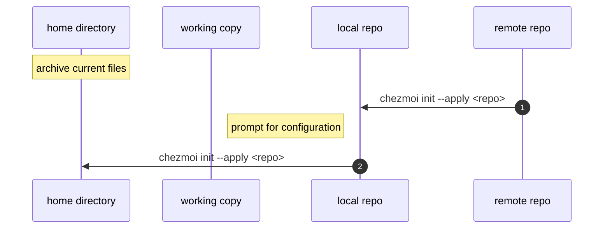
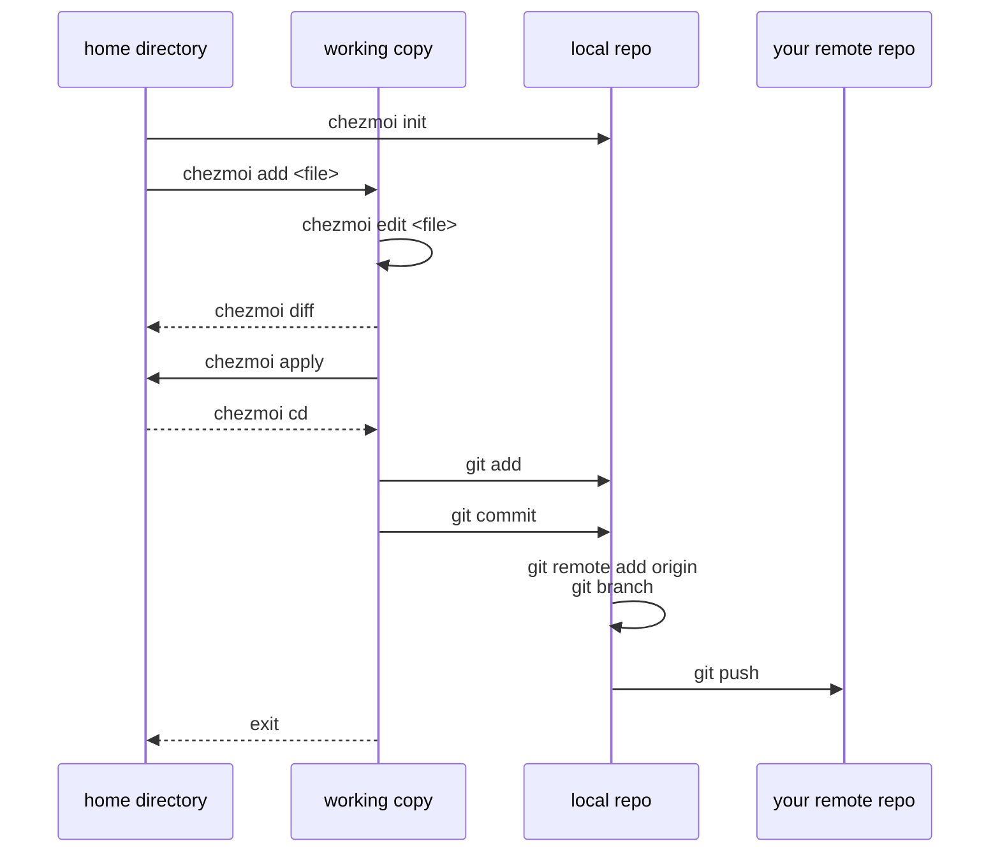

# dotfiles

Dotfiles are configuration files on `*NIX` systems and are used to customise the behaviour and appearance of common applications, command-line tools and shell. They can contain various predefined settings, functions, aliases, environment variables and other configurations that affect how programs behave and interact with the system.

The aim of such a setup is to ensure predictable and consistent behaviour across environments and workstations as well as to improve the engineering efficiency which results in better [Developer Experience (DX)](https://www.thoughtworks.com/en-gb/insights/blog/why-you-should-invest-good-developer-experience-today), allowing to implement mature developer workflows that integrate well with an [Internal Developer Platform (IDP)](https://www.thoughtworks.com/en-gb/insights/blog/devops/better-developer-platforms-key-better-digital-products).

Here is _[Your unofficial guide to dotfiles on GitHub](https://dotfiles.github.io/)_

## Table of Contents

- [dotfiles](#dotfiles)
  - [Table of Contents](#table-of-contents)
  - [Installation](#installation)
    - [Archive your current dotfiles configuration](#archive-your-current-dotfiles-configuration)
    - [Apply new configuration via `chezmoi`](#apply-new-configuration-via-chezmoi)
    - [Use the installation script from this repository](#use-the-installation-script-from-this-repository)
    - [Prerequisites](#prerequisites)
  - [Usage](#usage)
    - [Add and track a new file](#add-and-track-a-new-file)
    - [Store changes in your own repository](#store-changes-in-your-own-repository)
  - [Architecture](#architecture)
    - [Project structure](#project-structure)
    - [Project configuration](#project-configuration)
  - [Contributing](#contributing)
    - [Currently supported features](#currently-supported-features)
    - [Resources](#resources)
  - [Contacts](#contacts)
  - [Licence](#licence)

## Installation

This `dotfiles` repository is configured and managed by the `chezmoi` project. [chezmoi](https://www.chezmoi.io/), pronounced _/ʃeɪ mwa/ (shay-moi)_ is currently the [most complete and most hackable](https://www.chezmoi.io/comparison-table/) dotfiles manager out there. Please, follow the [installation guide](https://www.chezmoi.io/install/#one-line-package-install) specific to your operating system before proceeding.

### Archive your current dotfiles configuration

Prior to applying any changes to your home directory, create a backup of your current configuration. This command creates an archive file in the temporary directory that can be used later to restore the configuration, if needed.

```shell
chezmoi archive --output=/tmp/dotfiles.tar.gz
```

### Apply new configuration via `chezmoi`

The following instruction clones [\$GITHUB_ORG/dotfiles](https://github.com/make-ops-tools/dotfiles) repository into the `~/.local/share/chezmoi/` directory and next applies changes accordingly, to your home directory `~/`. During the setup it prompts you to provide configuration options like Git committer name and email address, etc.

```shell
chezmoi init --apply $GITHUB_ORG # "make-ops-tools"
```

### Use the installation script from this repository

You can use the convenience script to install the dotfiles on any machine with a single command. Simply run the following in your terminal

```shell
sh -c "$(curl -fsLS get.chezmoi.io)" -- init --apply $GITHUB_ORG # "make-ops-tools"
```

Installation flow diagram



### Prerequisites

- [Bitwarden CLI](https://bitwarden.com/help/cli/)

## Usage

### Add and track a new file

If you decide to extend the configuration of your dotfiles and include an additional file to be managed, here is an example on how to do that.

```shell
chezmoi add ~/.bashrc
chezmoi edit ~/.bashrc
chezmoi diff
chezmoi apply -v
chezmoi cd
git add .
git commit -S -m "Add .bashrc"
exit
```

### Store changes in your own repository

You may want to create a [new dotfiles repository](https://github.com/new) for then to add the remote origin to to your local copy and push the preferred changes. By doing so, it will give you better experience and more customisation options to extend the functionality making it your own.

```shell
git remote add origin https://github.com/$YOUR_GITHUB_USERNAME/dotfiles.git
git branch -M main
git push -u origin main
```

Usage flow diagram



## Architecture

### Project structure

The following files are managed by this dotilfes project

```shell
~ ($HOME)
│
├─── .gitattribute
├─── .gitconfig
└─── .gitignore
```

Some mechanisms like installation of packages do not follow the declarative approach and use imperative scripts to apply changes. However, they are written in an idempotent way and run only when a change is detected.

### Project configuration

This project can be customised and extended by creating a personal repository for then to be keep building on top of it.

## Contributing

### Currently supported features

- Cross-platform support for GitHub Codespaces, macOS, Ubutnu and Windows WSL
- File content templating for user customisation
- [GNU-compatible CLI tools](https://en.wikipedia.org/wiki/List_of_GNU_packages) to provide consistent experience for macOS users
- [Oh My Zsh](https://ohmyz.sh/) for managing shell configuration
- Git
  - Commit signing configuration
  - Essential `.gitconfig` setup
  - OS-specific `.gitignore` rules
  - Common `.gitattributes` rules

### Resources

More than a decade old [mathiasbynens/dotfiles](https://github.com/mathiasbynens/dotfiles) project is an inspiration and the main source of well established practices and features that have been borrowed for the purpose of improving Developer Experience in NHS England as an revamped version to fit into the organisation strategy.

## Contacts

- [Dan Stefaniuk](https://github.com/stefaniuk)

## Licence

> The [LICENCE.md](./LICENCE.md) file will need to be updated with the correct year and owner

Unless stated otherwise, the codebase is released under the MIT License. This covers both the codebase and any sample code in the documentation.

Any HTML or Markdown documentation is [© Crown Copyright](https://www.nationalarchives.gov.uk/information-management/re-using-public-sector-information/uk-government-licensing-framework/crown-copyright/) and available under the terms of the [Open Government Licence v3.0](https://www.nationalarchives.gov.uk/doc/open-government-licence/version/3/).
