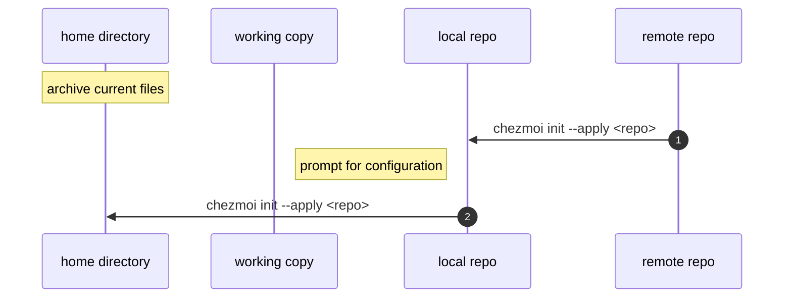
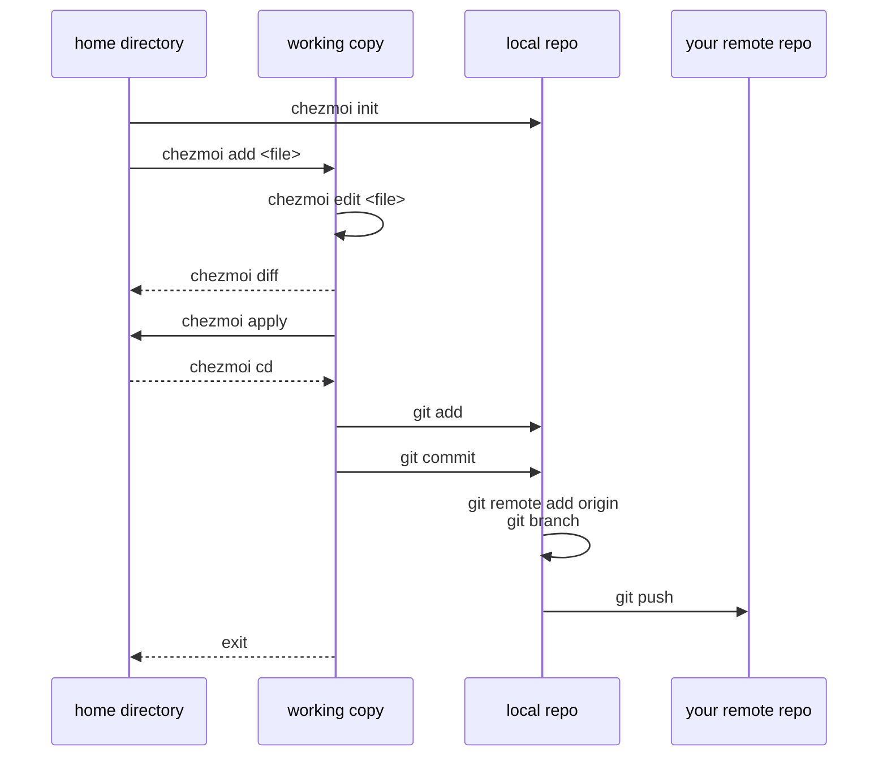

# Chezmoi Usage

- [Chezmoi Usage](#chezmoi-usage)
  - [Overview](#overview)
  - [Installation](#installation)
    - [Flow diagram](#flow-diagram)
  - [Usage](#usage)
    - [Flow diagram](#flow-diagram-1)
  - [Useful commands](#useful-commands)
    - [Apply changes from the local repository](#apply-changes-from-the-local-repository)
    - [Show cached configuration data](#show-cached-configuration-data)
    - [Test a template code snippet](#test-a-template-code-snippet)

## Overview

This dotfiles repository is configured and managed by the `chezmoi` project. [chezmoi](https://www.chezmoi.io/), pronounced _/ʃeɪ mwa/ (shay-moi)_ is currently the [most complete and most hackable](https://www.chezmoi.io/comparison-table/) dotfiles manager out there.

## Installation

The following instruction clones [dotfiles](https://github.com/make-ops-tools/dotfiles) repository into the `~/.local/share/chezmoi/` directory and next applies changes accordingly, to your home directory `~/`. During the setup it prompts you to provide configuration options like Git committer name and email address, etc.

```shell
bash -c "$(curl -fsLS get.chezmoi.io)" -- init --apply "make-ops-tools"
```

### Flow diagram



## Usage

If you decide to extend the configuration of your dotfiles and include an additional file to be managed, here is an example on how to do that

```shell
chezmoi add ~/.bashrc
chezmoi edit ~/.bashrc
chezmoi diff
chezmoi apply -v
chezmoi cd
git add .
git commit -S -m "Add .bashrc"
git push
exit
```

### Flow diagram



## Useful commands

### Apply changes from the local repository

```shell
chezmoi cd
pwd # should be ~/.local/share/chezmoi
chezmoi apply --init
```

### Show cached configuration data

```shell
chezmoi data | jq
cat ~/.config/chezmoi/chezmoi.toml
```

### Test a template code snippet

```shell
chezmoi execute-template '{{ (bitwarden "item" "dotfiles").identity.firstName }} {{ (bitwarden "item" "dotfiles").identity.lastName }}'
```
